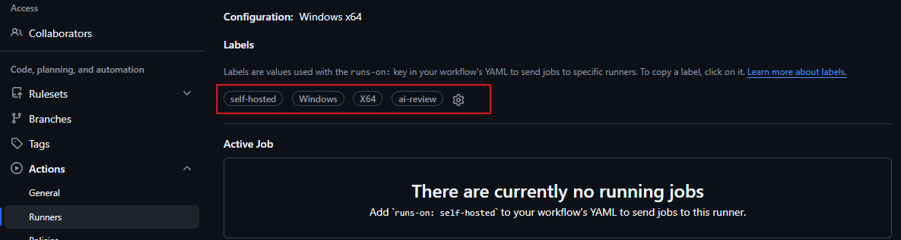
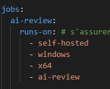
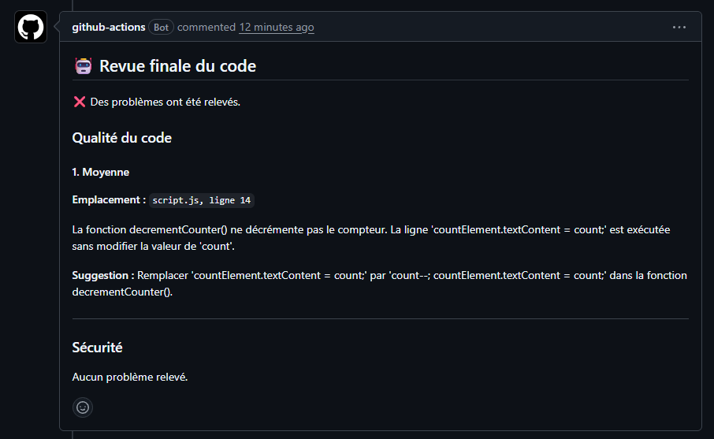

# Revue automatisée du code

## Structure du projet

- `workflows/` : contient le fichier de workflow à placer dans le repository du projet à analyser
- `agents/` : modules d’analyse de la qualité du code et de la sécurité
- `integrations/` : interfaces avec GitHub, Git et Ollama.
- `prompts/` : instructions destinées aux agents d’analyse
- `utils/` : décodage et validation des réponses au format JSON
- `pull_request_review.py` : orchestration des agents, publication du commentaire final sur la PR
- `review_formatter.py` : assemblage des différentes réponses des agents en texte final de la revue
- `requirements.txt` : liste des dépendances Python

## Mise en place

>
> ℹ️ 
> À la fin de la mise en place, vous devriez retrouver les trois dossiers suivants sur votre machine :
>
> 1) Le dossier du projet de revue automatisée : contient le code de ce repository, notamment les agents d’analyse et le script d’orchestration.
>
> 2) Le dossier du projet à analyser : contient le code du repository GitHub privé sur lequel vous effectuerez les tests en créant des issues et des pull requests.
>
> 3) Le dossier de configuration du runner : contient les fichiers nécessaires au fonctionnement du self-hosted runner GitHub Actions, créé lors des étapes de configuration du runner.
> 

### Sur la machine qui va rouler le processus de revue :

1. Installer Ollama et Python 3.12

2. Télécharger le modèle choisi 

   ```bash
   ollama pull qwen2.5-coder:7b
   ```
   
3. Cloner ce dépôt et relever le chemin local du clone (ex. : `C:\projects\ai_code_review`)

4. Exécuter les commandes suivantes :

   ```powershell
   cd C:\projects\ai_code_review

   py -3.12 -m venv .venv

   .\.venv\Scripts\python.exe -m pip install --upgrade pip
   .\.venv\Scripts\python.exe -m pip install -r requirements.txt
   ```

### Créer un repository privé (il est important que ce soit le cas) qui va recevoir les revues de code. Dans celui-ci :

1. Ajouter un self-hosted runner qui va utiliser votre machine. Suivre les [instructions ici](https://docs.github.com/en/actions/how-tos/manage-runners/self-hosted-runners/add-runners#adding-a-self-hosted-runner-to-a-repository).

2. Créer un workflow dans GitHub Actions (prendre le fichier qui se trouve dans `workflows/ai-review-workflow.yml`, remplacer les valeurs au besoin). Définir le modèle et la taille du contexte à utiliser dans les variables d'environnement du workflow.

> ⚠️ Les labels du runner doivent être identiques (insensible à la casse) à ceux du fichier workflow `.yml`, sinon le runner ne va pas détecter la tâche à rouler. Il est possible de mettre moins de labels.
>
> 
>
> 


#### Pour lancer une revue de code

1. Créer une issue, puis ouvrir une pull request qui y fait référence (par exemple au moyen de `Closes #123` dans la description de la PR, en remplaçant `123` par le numéro de l’issue).

2. La revue devrait se lancer. Attendre que l'action se termine et que le commentaire soit publié.




## Éléments manquants ou à revoir

- Scénarios de test
- Réviser les fichiers d'instructions existants. Revoir le format utilisé pour les réponses des modèles.
- Ajouter les agents manquants et les fichiers d'instructions associés.
- Nettoyer et améliorer le code (considérer également l'utilisation de LangGraph).
- Essayer d'automatiser d'autres étapes du workflow (fichier `.yaml`).
- Vérifier les enjeux de sécurité liés au self-hosted runner. (?)
